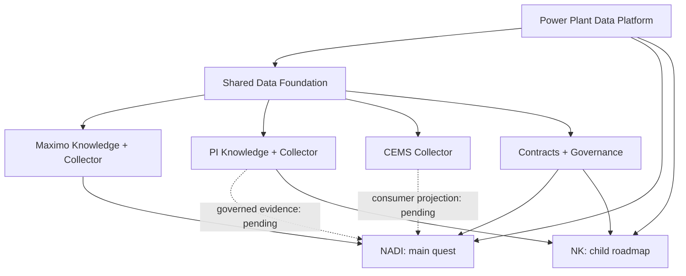

# Power Plant Data Platform — vision dan batas arsitektur

Status: **CURRENT architectural direction**. Baseline dan branch exceptions
ada di [Repository Status](REPOSITORY-STATUS.md). Repository tidak perlu
berganti nama untuk menjalankan visi ini.

## Shared foundation dan consumer



Diagram menggambarkan ownership dan arah target. Edge PI → NK baru tersedia di
feature branch; PI/CEMS → NADI bukan integrasi yang sudah diterima di `main`.

**Collectors = shared platform capabilities. Applications = consumers.**
Satu PI Collector dapat melayani NADI, NK, dan aplikasi analitik berikutnya;
penambahan consumer tidak berarti menambah source worker atau database.

| Lapisan | Memiliki | Tidak memiliki |
|---|---|---|
| Source knowledge | endpoint/field/registry yang diverifikasi, bukti dan unknown | product scoring atau app runtime |
| Collectors | credential sumber, guard, polling/cadence, source quality, local snapshots/history dan API | identitas lintas sumber hasil tebakan atau workflow produk |
| Contracts / governance | canonical identity, unit, scope, provenance, hubungan dengan bukti | promosi field/tag tanpa evidence |
| NADI | factual read model, governed asset context, engineering intelligence bertahap | discovery produksi mandiri atau write-back Maximo implisit |
| NK | fitur/model/scaler, validasi input dan prediksi nilai kalor | PI credential, PI SQL access atau collector/database baru |

## Alur saat ini dan pengecualian yang disengaja

```text
Maximo → Maximo Collector DB
             ├→ Collector API → legacy Cockpit store / legacy KPI
             └→ canonical Reliability Mart (di DB Maximo yang sama)
                                  ↓ SELECT-only
                           NADI /v1/reliability/* → Next.js UI

PI → PI Collector snapshots/timeseries → API → NK [UNMERGED]
                                      └→ NADI governed evidence [PENDING]
Manual / CSV ───────────────────────────────────→ NK [UNMERGED]
CEMS PLC → CEMS Collector DB/API → dashboard
                               └→ NADI projection [PENDING]
```

NADI canonical Mart reader adalah pengecualian eksplisit terhadap proposal lama
“Cockpit hanya API collector”. `DATABASE_URL` adalah store legacy Cockpit;
`RELIABILITY_MART_DATABASE_URL` adalah koneksi SELECT-only ke Mart existing.
Koneksi kedua bukan database kedua untuk NADI. Internal mapping administration
memakai workflow tulis lokal yang terpisah; public Mart API tetap read-only.

Governed `reliability_asset_registry` menentukan normal NADI Asset membership.
Broad `equipment` dan `asset_master` menjadi konteks teknis, bukan otomatis
business registry. `asset_af_mapping` juga berada di Mart existing. `PROPOSED`
belum dapat dipakai; satu `VERIFIED PRIMARY_EQUIPMENT` menghasilkan `MAPPED`;
lebih dari satu menghasilkan `AMBIGUOUS`, tanpa memilih pemenang diam-diam.

[Mart query API](../reliability-cockpit/docs/reliability-mart-query-api.md) dan
[local projection](../maximo-collector/docs/mx-012r-unified-collector-mart-pipeline.md)
menjelaskan batas implementasi. Penulisan canonical data tetap milik pipeline
collector/projection. Bootstrap registry dari laporan adalah administrasi
terkendali, bukan discovery baru atau izin mengimpor data personal.

## Persistence dan runtime

Reuse empat store managed yang sudah didesain: `maximo-db/maximo_collector`,
`pi-db/pi_collector`, `cems-db/cems_collector`, `cockpit-db/cockpit`.
Reliability Mart berada di store Maximo; NK tidak punya DB. Perubahan schema
kompatibel masuk ke store pemilik. Jangan tambah DB/container/volume atau
mengganti Compose project untuk melanjutkan fitur biasa.

Root Compose project `reliability-cockpit-platform` dan mode alternatif
`reliability-cockpit-external` mempunyai volume berbeda. Jangan menganggap
pergantian mode sebagai restart biasa. Konfigurasi Mart Compose pada baseline
`main` belum lengkap; kandidat fix dan overlap feature dibahas di status audit.
Keberadaan file Compose tidak membuktikan collector hidup atau datanya fresh.

## Safety dan semantic trust

- Maximo business resources dan PI tetap GET/HEAD/OPTIONS. Hanya handshake
  Maximo `/j_security_check` yang menjadi pengecualian autentikasi terkontrol.
- CEMS hanya FC03/FC04; operator normalization overrides tetap berlaku.
- Pertahankan BSR/IP dan unit scope, rate/size cap, bounded pagination, retry,
  cursor semantics dan PI off-hours guard. Tidak ada source egress dari consumer.
- Tidak ada fuzzy/name-based identity join, dummy business data atau silent
  fallback untuk evidence yang hilang. Waktu record bukan bukti sync freshness.
- Vendor fields tetap di `sources.*`; public NADI DTO hanya mengekspos subset
  yang disetujui. Sanitasi samples; secrets/PII/production exports tidak masuk Git.
- Factual observations, derived metrics, ML prediction dan operational action
  mempunyai acceptance berbeda. Tidak ada health/risk/failure claim hanya dari
  label. Recommendation belum memberi izin membuat/mengubah WO Maximo.

## Product hierarchy

[NADI Phase 0–5](NADI-ROADMAP.md) adalah roadmap utama. [M0–M8](reliability-cockpit-platform/05-roadmap-implementasi.md)
merupakan implementation roadmap di bawahnya. [NK-00–07](NK-ROADMAP.md) memakai
foundation yang sama dengan acceptance terpisah; prediksi kalor bukan indikator
reliability Asset NADI. Aplikasi mendatang harus mempertahankan pemisahan ini.
