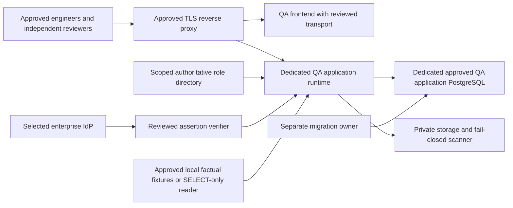

# Bundle E — governed QA preparation (E0/E1)

Baseline: eda3595a9b8d86726dd0d89192ebf4657b66d27e; PR44–50 MERGED.
No real QA or production deployment is authorized. This is preparation, not UAT.
Original workspace and other worktrees are preserved. No open overlapping PR
was present at preflight. Phase1 remains CURRENT/PARTIAL.

## Evidence and dependencies

Repository inspection, not live-host inventory: existing operational
`src/api/app.py` never mounts Engineering routers; the development-only
`create_qa_app` requires a loopback *_test PostgreSQL store. Existing API Dockerfile
runs the public read-only cockpit server and omits application migrations.
It is NOT a real QA Engineering entrypoint. Existing QA browser proxy is
development-only, not a production-auth proxy. Existing SessionAuthority and
EnterpriseIdentityAdapter are injected seams, not an enterprise login.

Graph generation 2026-08-24 misses all six new Bundle D identity/migration/
attachment/factory/proxy paths. Exact merged files were read; graph absence was
not used as proof of missing features. E0 baseline tests: Cockpit610, Maximo181,
PI191 including11Timescale, contracts14 and frontend110 PASS on exact baseline.
Scoped final-main GitHub run37895125769 backend/frontend SUCCESS.

Available hosting evidence: source-controlled Compose/Dockerfiles, local-only
QA harness, immutable application migrations002–005, source-read-only guards,
Mart reader separation and previous disposable backup/restore. No live host,
private config, topology, IdP, DNS or source system was accessed for inventory.

## Separate QA architecture

No path from QA to Maximo/PI/CEMS acquisition or mutation. Factual access starts
with fixtures; live/local Mart access requires separate approved SELECT-only
credential and asset scope. QA must not reuse production credentials or databases.
QA writer is not Mart owner; application recommendations never create/update WO.

The owning DB must be explicitly approved. A new dedicated QA DB is deliberate
environment architecture, not a replacement production Mart or source store.
ApplicationStore's old legacy anchors must not be fabricated to bypass identity;
E3 will provide an explicit dedicated-store mode with wrong-DB/Mart guards.

## REQUIRED_OPERATOR_INPUT

| Decision | Required authority/evidence |
|---|---|
| QA host/server and runtime capacity | Platform owner; no guessed host path/IP |
| DNS, HTTPS origin, TLS/private key authority | Network/security owner |
| Exact pinned release/image digests | Reviewed candidate and image build provenance |
| IdP/issuer/client/redirect/logout | Identity owner and application registration |
| Durable role directory, independent reviewers/asset grants | Reliability + security owners |
| QA DB name, owner, capability and LOGIN role names | DBA; separate credentials and grant audit |
| Allowed factual-data scope | Data owner; fixtures by default |
| Private storage/encryption/scanner | Security/storage owners |
| Session/deadline/quota/retention policies | Explicit approved values; no invented SLAs |
| PdM method fields and UAT acceptance | Accountable method engineers |

## Activation boundaries

Every real-host/image/service/role/DDL/backup/restore command requires explicit
operator approval tied to environment, SHA, action and scope. Templates are
default-off, have no collector/scheduler, and contain no source credentials.
Do not run platform Compose, operational init-db/mart-migrate, or discovery.

QA preparation cannot self-approve infrastructure, manufacture real identities,
or turn the fixture QA page into operational authority. Startup integration,
enterprise verifier/directory, frontend trusted callback and final UAT stay
NO-GO until their real adapters are reviewed and exact config approved.

Rollback: disable QA routes and revoke QA runtime authority; preserve application
audit/revisions/files. Never roll back through Mart reset or source recollection.
See subsequent E2–E8 checkpoints for executable source-free preflight and drills.
