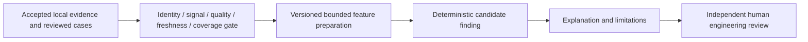

# Phase 3 diagnostic foundation — offline design

Status: **DESIGN READY for technical review; production diagnostics NOT READY**.
Baseline: e67c641e23214bf8851a05d312e1426c1e471ec3. Phase 1 remains CURRENT/PARTIAL;
Phase 2 candidate is IN DEVELOPMENT. This design neither extends GOV-03 expiry
nor authorizes acquisition, history, deployment, automatic alerts or work orders.

## Available evidence and limits

The existing factual Mart contains registered asset and maintenance populations.
The accepted Coal Feeder A pilot has one VERIFIED mapping, one approved coal_flow
selection and one latest condition record. Those are historical accepted runtime
facts, not newly queried by this source-free task. A latest-only record and a few
manual observations do not establish a time series, operating envelope or anomaly
threshold. The 433 technical PI attributes are collection inventory, not 433
approved NADI signals. Collector history cannot be reused as governed asset
history without exact approved identity, signal semantics and bounded access.

Engineering cases are human records in the application store. Hypotheses and
review decisions never become source facts. This bundle's UI uses synthetic
fixtures; no operational case or diagnostic finding is created.

## Candidate use cases and evidence readiness

| Use case | Required Maximo/local records | Required selected PI signals | Identity, unit and meaning | Present limit |
|---|---|---|---|---|
| Coal Feeder A abnormal-flow investigation | Exact asset, related maintenance events/WO, operating context | Approved coal_flow; additional load/run-state only after separate approval | VERIFIED PRIMARY_EQUIPMENT; original Ton/h, no conversion; flow is process evidence, not health | One latest sample; no approved operating envelope, source/projection policy or bounded governed history |
| Equipment operating trend | Registered asset and equipment context | Explicit engineering-selected measurements and run state | Each signal mapped exactly; engineering unit and measurement direction approved | Technical history availability does not prove asset-level governed time-window readiness |
| Maintenance repeat activity | Asset registry, deduplicated maintenance/WO IDs, event dates/status/work type | Optional governed condition context; not required for factual counts | Canonical asset joins; actual start versus source change distinguished | Factual recurrence is investigation activity, not repeated failure or risk; observation window and completeness need review |
| Work Order recurrence patterns | Controlled WO category, equipment identity, dates and completion semantics | Optional approved operating context | Stable WO identity, site scope and deduplication; no name matching | WO descriptions alone cannot label failure cause; missing or closed/open date semantics must remain visible |
| Early-warning hypotheses | Reviewed cases, exact maintenance context and future confirmed outcomes | Approved signals with sufficient contextual history | Measurement semantics, equipment state and threshold authority required | Ground truth, condition freshness policy and false-positive/negative evaluation absent; production warning BLOCKED |
| Evidence-linked diagnostic assistance | Versioned case, local factual references, governed condition snapshot, review history | Only signals explicitly referenced by accepted evidence | Explanation cites immutable source versions; judgment separate from observation | Trusted user identity and protected case activation still blocked; offline synthetic explanation only |

## Temporal, quality and human prerequisites

| Use case | Window / sampling / compression | Quality and freshness gates | Ground truth and accountable reviewer |
|---|---|---|---|
| Abnormal flow | Future bounded operating episodes; minimum coverage and gap rules set by engineer; preserve irregular sampling and interpolation/compression metadata | Separate collector, source and projection times; explicit approved policies; Good/Questionable/Substituted/Annotated retained | Boiler/process engineer approves envelope and state context; instrument engineer confirms measurement semantics |
| Trends | Engineer-selected window and resolution; no resampling across undocumented gaps; original units; transformations versioned | Bad/missing/unknown quality excluded from normality inference; report coverage; stale or UNKNOWN is not CURRENT | Equipment engineer reviews operating regimes; confirmed intervention/outcome if anomaly accuracy is claimed |
| Maintenance activity | Explicit date interval, timezone, event timestamp basis and capture completeness; no PI resampling | Collector/Mart currentness separately assessed; unresolved joins excluded and counted | Reliability/maintenance engineer checks event interpretation; no failure label fabricated |
| WO recurrence | Explicit time interval and event/WO deduplication; distinguish one WO's status changes from multiple jobs | Projection watermark and missing dates visible; incomplete population cannot imply absence of activity | Maximo process owner validates WO taxonomy and linkage; reliability reviewer interprets patterns |
| Early warning | Enough accepted historical episodes and outcome follow-up; sampling plan reviewed before feature work | All identity, signal approval, quality, source/projection policy and coverage gates required | Named engineering threshold owner; labeled true/false alerts and missed events; no current synthetic accuracy claim |
| Assistance | Frozen versioned case evidence, with live references re-resolved explicitly; explanation records evidence as-of time | Missing/stale/UNKNOWN context stated in finding; reviewer cannot manufacture CURRENT | Trusted independent reviewer validates explanation; model output is an unapproved hypothesis |

Time windows and coverage minima are deliberately unspecified until engineering
review. Acquisition cadence is not an SLA. Existing monitoring 660/660/1800 seconds
applies only to the accepted component policies and manual expiry; condition
source/projection thresholds remain UNSET. An epoch timestamp or future timestamp
must retain its objective invalid/stale semantics under the canonical policy; it
cannot be repaired by a recent collection or case save.

## Proposed offline architecture

The gate consumes canonical models, not raw PI URLs, credentials or unrestricted
vendor payloads. It verifies exact asset mapping and signal approval, then checks
quality, missing values, time basis, window coverage and approved policies. Gate
failure returns INSUFFICIENT_EVIDENCE with typed reasons. It never returns a green
asset state. Historical evidence may remain useful for historical analysis while
being unusable for a claim about the current condition.

Feature preparation is pure/offline first. Each output records canonical asset,
evidence/reference IDs, mapping and approval versions, source/collection/projection
and analysis times, original unit, sampling/compression context, transformation
version and parameters. Missing/text/digital/boolean values are typed; none becomes
numeric zero implicitly. No interpolation or normalization occurs without a
reviewed transformation contract. Derived features retain input lineage.

Start with transparent engineering-owned rules, if justified, before ML. A rule
must record algorithm version, engineer-approved threshold reference/scope/expiry,
operating-state constraints and exact evidence IDs. A candidate finding includes
observation, explanation, alternative causes, limitations and review state. It is
not a confirmed diagnosis, health score, prediction or maintenance recommendation.
Confidence is UNKNOWN until a defensible calibration method and labeled evaluation
exist; a numeric confidence fabricated from rule firing is prohibited.

Replays use frozen versions and deterministic parameters; identical inputs produce
identical findings. Changes in input, rules or policies produce a new version,
never overwrite accepted historical judgment. Human feedback is attributable and
may become an evaluation label only under an explicit reviewed labeling process.
Evaluate false alerts, missed events, operating-regime bias and coverage before
production consideration. Offline synthetic tests prove mechanics, not prediction
accuracy. No finding can issue or update a Maximo WO or trigger source operations.

## Review gates and next work

1. Authenticate Engineering users, asset permissions and independent reviews;
   protect application writer and audit retention before accepting real cases.
2. Agree use case, operating-state context, time window and unit semantics with
   named engineering reviewers; separately approve any additional signal.
3. Establish condition source/projection policies and governed historical evidence
   access where needed. No blanket reuse of the technical registry or history.
4. Build source-free feature/finding contracts and replay tests using reviewed
   synthetic scenarios; add a deterministic rule only after its semantics are clear.
5. Obtain representative ground truth and reviewer evaluation before any warning
   or ML accuracy claim. Production diagnosis and autonomous action remain blocked.

The optional offline rule POC was not implemented: the requested architecture and
readiness assessment are complete without inventing an unapproved threshold.

Related: [Engineering ADR](adr/006-engineering-workspace.md),
[threat model](engineering-workspace-threat-model.md),
[bundle acceptance](nadi-phase2-overnight-bundle-01.md).
